# 🚢 FreightQuote AI — Milestone 4

## Agentic AI for Maritime Freight Pricing & Route Optimization

**Infosys Springboard 7.0 — Batch 1**  
**Milestone:** 4  
**Domain:** Agentic AI for Maritime Freight Pricing and Route Optimization

FreightQuote AI is an **agentic maritime intelligence and predictive-operations platform** for ocean-freight decision support. It combines route and port intelligence, freight pricing, carrier analysis, weather risk, margin prediction, customs and tariff analysis, document/OCR processing, multilingual translation and document-based RAG in one Streamlit workspace.

> **Core principle:** use structured data, calculations, ML outputs, APIs and retrieved documents as operational evidence, while the LLM provides natural-language reasoning and explanation over that evidence.

---

## 📑 Table of Contents

- [1. Project Overview](#1-project-overview)
- [2. Problem Statement](#2-problem-statement)
- [3. Objectives](#3-objectives)
- [4. Proposed Solution](#4-proposed-solution)
- [5. Key Features](#5-key-features)
- [6. System Architecture](#6-system-architecture)
- [7. Nine AI Agents](#7-nine-ai-agents)
- [8. Shared Platform Features](#8-shared-platform-features)
- [9. AI Copilot](#9-ai-copilot)
- [10. Hybrid RAG](#10-hybrid-rag)
- [11. Machine Learning](#11-machine-learning)
- [12. Route Optimization](#12-route-optimization)
- [13. Pricing Engine](#13-pricing-engine)
- [14. Weather Risk](#14-weather-risk)
- [15. Customs, Documents and Translation](#15-customs-documents-and-translation)
- [16. Knowledge Graph](#16-knowledge-graph)
- [17. Digital Twin](#17-digital-twin)
- [18. Anomaly Scanner and Data Feed Center](#18-anomaly-scanner-and-data-feed-center)
- [19. Authentication and RBAC](#19-authentication-and-rbac)
- [20. Admin Dashboard](#20-admin-dashboard)
- [21. Database and Data](#21-database-and-data)
- [22. Technology Stack](#22-technology-stack)
- [23. Project Structure](#23-project-structure)
- [24. Running the Project](#24-running-the-project)
- [25. Docker Deployment](#25-docker-deployment)
- [26. Cloudflare Public Preview](#26-cloudflare-public-preview)
- [27. Screenshots](#27-screenshots)
- [28. Testing and Validation](#28-testing-and-validation)
- [29. Limitations](#29-limitations)
- [30. Future Scope](#30-future-scope)
- [31. Conclusion](#31-conclusion)

---

# 1. Project Overview

FreightQuote AI is an **agentic decision-support platform for maritime/ocean freight operations**.

Maritime freight decisions depend on multiple changing signals:

- Port congestion and dwell time
- Route distance and sailing time
- Freight rates and surcharges
- Carrier reliability
- Weather and storm conditions
- Customs and tariff requirements
- Shipping documents
- Profit margins
- Maritime policies and reference documents

FreightQuote AI connects these areas through **nine specialized agents** and a shared platform layer containing authentication, RBAC, notifications, AI Copilot, Knowledge Graph, Digital Twin, anomaly analysis, data-feed monitoring and administration.

### Design principles

1. **Grounded generation** — operational answers should be based on database facts, computed results, APIs or retrieved documents.
2. **Transparent ML** — prediction agents compare multiple classical ML models and expose model-performance information.
3. **Role-aware access** — application navigation is filtered according to the authenticated user's role.
4. **Fail-soft AI** — the intended LLM architecture supports a smaller fallback model if the primary model cannot load.
5. **Decision support rather than generic chat** — the Copilot connects the user's question to domain tools and evidence.

---

# 2. Problem Statement

Maritime freight operations are affected by fragmented information and rapidly changing operational conditions.

### Main challenges

| Challenge | Impact |
|---|---|
| Freight-price uncertainty | Difficult to estimate competitive and profitable quotes |
| Route uncertainty | Distance alone does not represent congestion or operational risk |
| Weather disruption | Storms and severe weather can affect port/vessel operations |
| Carrier selection | Reliability and risk must be considered alongside cost |
| Margin pressure | Low freight cost does not always mean good profitability |
| Customs complexity | HS codes, duties and documents affect clearance |
| Document overhead | Shipping documents require extraction and validation |
| Distributed knowledge | Important information exists across manuals, policies and PDFs |
| Language barriers | Maritime content may need multilingual processing |
| Operational incidents | Alerts need a centralized monitoring surface |

### Motivation

```text
Ports & Routes
      +
Pricing & Margins
      +
Carriers
      +
Weather
      +
Customs & Documents
      +
Alerts & Knowledge
      ↓
FreightQuote AI
      ↓
Connected Maritime Decision Support
```

---

# 3. Objectives

Milestone 4 aims to:

1. Build an integrated maritime decision-support workspace.
2. Provide nine specialized AI-agent modules.
3. Connect structured data, ML models, APIs and documents.
4. Provide a natural-language AI Copilot.
5. Support document retrieval through vector and lexical search.
6. Provide route, port and congestion intelligence.
7. Provide freight pricing and margin intelligence.
8. Provide carrier and weather-risk analysis.
9. Provide customs, tariff and document intelligence.
10. Provide multilingual translation.
11. Provide centralized operational notifications.
12. Provide Knowledge Graph and Digital Twin capabilities.
13. Provide anomaly analysis and data-feed visibility.
14. Implement authentication, JWT sessions and RBAC.
15. Provide an administrative command center.
16. Support reproducible execution from the Milestone 4 notebook.
17. Support public preview through Cloudflare Tunnel.
18. Prepare the application for Docker/local deployment.

---

# 4. Proposed Solution

The platform follows this decision-support workflow:

```text
User Request
     ↓
Authentication / RBAC
     ↓
AI Copilot or Direct Agent
     ↓
Intent / Module Selection
     ↓
SQL + ML + Route Solver + API + RAG
     ↓
Evidence / Results
     ↓
Qwen 2.5 Reasoning
     ↓
Grounded Natural-Language Response
```

### Overall intelligence cycle

```text
Retrieve → Calculate → Predict → Reason → Respond
```

The LLM is therefore not intended to independently invent operational prices, statistics or maritime facts. It receives information from the relevant application components and converts the information into a human-readable response.

---

# 5. Key Features

| Feature | Purpose |
|---|---|
| **AI Copilot** | Natural-language maritime decision support |
| **Agent 1 — Route AI** | Route, port, congestion and sailing intelligence |
| **Agent 2 — Spot Quotes** | Freight quotation and cost analysis |
| **Agent 3 — Carriers** | Carrier reliability and performance analysis |
| **Agent 4 — Weather Risk** | Weather, storm and port-risk analysis |
| **Agent 5 — Margin Predictor** | Margin and profitability intelligence |
| **Agent 6 — Customs & Tariff** | HS-code, duty and clearance analysis |
| **Agent 7 — Docs/OCR** | Shipping-document processing and generation |
| **Agent 8 — Translation** | Multilingual maritime translation |
| **Agent 9 — PDF RAG** | Custom document indexing and Q&A |
| **Notifications** | Centralized alerts and incidents |
| **Knowledge Graph** | Maritime entity relationships |
| **Digital Twin** | Network/port scenario simulation |
| **Anomaly Scanner** | Unusual operational-pattern detection |
| **Data Feed Center** | Data and system-feed visibility |
| **Admin Dashboard** | Platform administration and monitoring |
| **Authentication/RBAC** | Secure role-aware access |

---

# 6. System Architecture

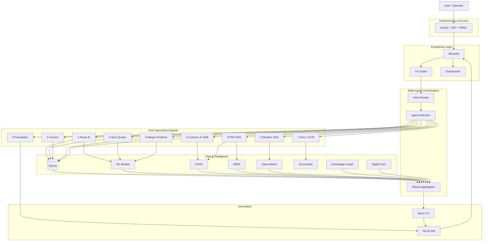

## Five conceptual layers

### Layer 1 — Authentication & Access
bcrypt password hashing, JWT sessions and RBAC.

### Layer 2 — FreightQuote Platform
Streamlit UI, AI Copilot and nine specialized agents.

### Layer 3 — Multi-Agent Orchestration
Intent routing, agent selection, coordination and result aggregation.

### Layer 4 — Data & Intelligence
SQLite, ML models, FAISS, BM25, weather data, documents, Knowledge Graph and Digital Twin.

### Layer 5 — Generation
Qwen 2.5 for grounded natural-language reasoning and NLLB-200 for translation.

---

# 7. Nine AI Agents

## Agent 1 — Route Intelligence & Eco-Speed AI

Agent 1 provides maritime route and port intelligence.

### Capabilities

- Global and Indian port information
- Port congestion index
- Average dwell time
- Active-vessel indicators
- Haversine distance
- Sailing-time estimation
- Route-risk analysis
- Candidate route comparison
- Interactive port mapping
- Vessel sailing simulation
- Bunker/fuel cost simulation
- Eco-speed / slow-steaming analysis
- Route-delay prediction/advisory

### Route workflow

```text
Origin + Destination
        ↓
Port Coordinates
        ↓
Haversine Distance
        ↓
Congestion + Dwell + Risk
        ↓
Route Scoring
        ↓
Ranked Route Options
```

---

## Agent 2 — Spot Freight Quote & Cost Engine

Agent 2 calculates and analyzes container freight quotes.

### Capabilities

- Spot freight calculation
- Base freight
- Fuel/BAF surcharge
- Insurance and customs/terminal fee components
- Final quote calculation
- Pricing sensitivity
- Quote comparison
- Pricing regression analysis
- Cost explanation

### Quote model

```text
Base Freight
    +
Fuel / BAF
    +
Insurance
    +
Customs / Fees
    +
Other Charges
    ↓
Final Freight Quote
```

The UI can also expose advanced analytics such as cost build-up, correlations and quote-pipeline views.

---

## Agent 3 — Ocean Carrier Intelligence & Audit

Agent 3 evaluates carrier performance and suitability.

### Capabilities

- Carrier reliability
- Rating comparison
- On-time delivery
- Average cost indicators
- Risk-level analysis
- Carrier scorecards
- Fleet/capacity allocation simulation
- Carrier decision support

---

## Agent 4 — Weather Risk & Typhoon Predictor

Agent 4 monitors weather and operational risk at monitored ports.

### Capabilities

- Open-Meteo weather data
- Port weather analysis
- Weather severity
- Wind and wave analysis
- Storm/typhoon indicators
- Potential delay risk
- Rerouting/simulation concepts
- Weather maps
- AI Weather Advisor

### Weather workflow

```text
Port Coordinates
      ↓
Open-Meteo
      ↓
Weather Data
      ↓
Severity / Risk Logic
      ↓
Port Risk
      ↓
Advisory / Visualization
```

---

## Agent 5 — Freight Margin Predictor & Yield Engine

Agent 5 analyzes where freight margin is earned or lost.

### Capabilities

- Margin prediction
- Margin percentage analysis
- Cost/revenue relationships
- BAF impact
- Rate sensitivity
- Carrier yield comparison
- Margin distribution
- Margin optimization

The objective is to avoid optimizing only for the cheapest freight option when that option may produce poor profitability.

---

## Agent 6 — Customs & Tariff Compliance Engine

Agent 6 supports customs and tariff decisions.

### Capabilities

- HS-code analysis
- Tariff lookup within application data
- Basic Customs Duty (BCD)
- IGST calculation
- Clearance-risk estimation
- Required-document awareness
- Regulatory advisory
- High-risk lane identification

### Customs workflow

```text
Cargo
 ↓
HS Code
 ↓
Origin / Destination
 ↓
Duty + Tax
 ↓
Required Documents
 ↓
Clearance Risk
```

---

## Agent 7 — Bill of Lading & Document OCR Studio

Agent 7 processes shipping documents.

### Capabilities

- Bill of Lading information extraction
- OCR/text extraction
- Field extraction
- Document validation
- Shipping-document generation
- Document anomaly/fraud-analysis concepts

```text
Document Upload
      ↓
OCR / Text Extraction
      ↓
Field Extraction
      ↓
Validation
      ↓
Structured Information
```

---

## Agent 8 — Multilingual Maritime Translator

Agent 8 uses **NLLB-200**.

### Capabilities

- Maritime text translation
- Document translation
- Copilot-response translation
- Batch translation
- Maritime glossary
- Supported-language workflows
- Numerical-integrity checks
- Domain terminology protection

Important values such as currencies, measurements, HS codes, port codes and maritime terminology should remain intact.

---

## Agent 9 — PDF Vector RAG Studio

Agent 9 is the custom document knowledge workbench.

### Supported document types

- PDF
- TXT
- Markdown

### Workflow

```text
Upload Document
      ↓
Text Extraction
      ↓
Chunking
      ↓
Embeddings
      ↓
FAISS + BM25
      ↓
Relevant Evidence
      ↓
Grounded Q&A
```

The UI supports document Q&A, knowledge-base management, document filtering/isolation and evidence/citation information.

---

# 8. Shared Platform Features

The nine agents are supported by common platform services.

### AI Copilot
Natural-language entry point for multi-agent questions.

### Notifications
Central operational alert and incident stream. It is **not Agent 10**.

### Knowledge Graph
Relationships between ports, routes, carriers and other maritime entities.

### Digital Twin
Scenario-oriented simulation of port/network behavior.

### Anomaly Scanner
Identifies unusual patterns in operational data.

### Data Feed Center
Provides visibility into raw operational and system feeds.

### Admin Dashboard
Platform-wide administration, user management, database maintenance, GPU/VRAM telemetry and chat monitoring.

### Profile
User-facing profile/session area.

---

# 9. AI Copilot

The AI Copilot is the primary natural-language interface.

### Example query

> What will it cost to ship a 20ft container from Chennai to Rotterdam next week, and are there any weather risks on the route?

The system can combine multiple sources:

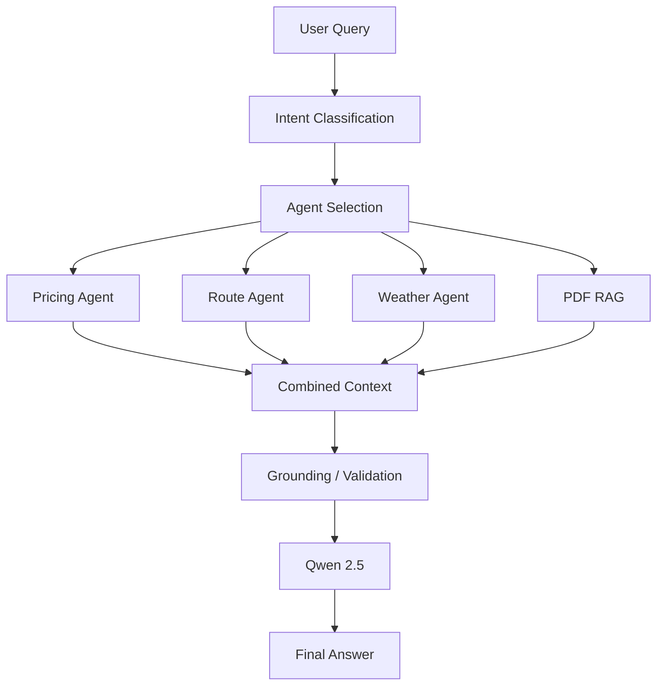

### Grounding sources

The Copilot can use:

- SQLite/database facts
- Computed route results
- Freight quote calculations
- ML outputs
- Weather/API information
- Retrieved document evidence

### Hallucination policy

The architecture is designed to **reduce hallucination risk through grounding**. It should not be described as a mathematical guarantee of zero hallucination.

---

# 10. Hybrid RAG

FreightQuote AI combines dense semantic retrieval with lexical retrieval.

## FAISS

FAISS performs vector similarity search. It is useful when the query is semantically related to a document even when the exact wording differs.

## BM25

BM25 provides lexical retrieval and is useful for exact domain terminology such as:

- HS Code
- BAF
- TEU
- Bill of Lading
- Port codes
- Carrier names

## Hybrid pipeline

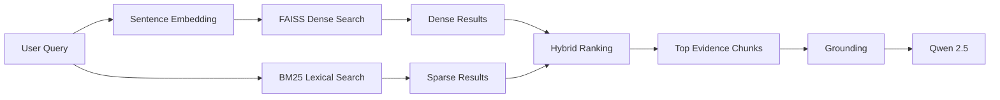

The RAG Builder used during development creates searchable artifacts. The application runtime then consumes retrieval resources through its RAG engine and Agent 9.

---

# 11. Machine Learning

The project uses classical ML for prediction and analytics.

### Common algorithms

- Random Forest
- Gradient Boosting
- Decision Tree
- Linear Regression
- Ridge Regression
- Lasso Regression
- Logistic Regression
- SVC / SVR
- Isolation Forest for anomaly detection

### General pipeline

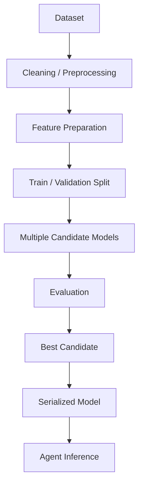

### Model evaluation

Classification tasks can use metrics such as:

- Accuracy
- F1

Regression tasks can use:

- R²
- RMSE

The application can compare candidate models and select the strongest model according to the relevant benchmark.

> **Data-quality note:** some training workflows can use fallback/synthetic data when a suitable real dataset or target column is unavailable. Metrics produced from synthetic fallback data must not be represented as real-world production accuracy.

---

# 12. Route Optimization

Agent 1 combines geographic and operational factors.

### Haversine distance

Haversine distance estimates great-circle distance between two latitude/longitude coordinates.

It provides a geographic distance foundation that can then be combined with:

- Congestion
- Dwell time
- Risk
- Sailing speed
- Bunker/fuel assumptions

### Route decision flow

```text
Port A
  ↓
Candidate Routes
  ↓
Distance
  ↓
Congestion
  ↓
Dwell / Risk
  ↓
Sailing Time
  ↓
Fuel / Bunker Effects
  ↓
Route Score
  ↓
Recommendation
```

---

# 13. Pricing Engine

Agent 2 combines freight components into an explainable quote.

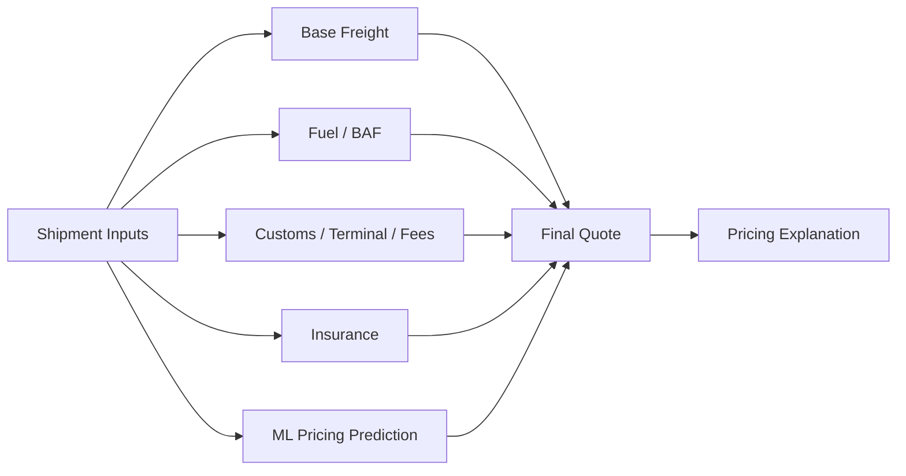

Advanced pricing analytics include cost build-up, correlation analysis, quote pipeline analysis and model comparison.

---

# 14. Weather Risk

The Weather Risk agent uses Open-Meteo weather information for monitored port coordinates.

### Risk architecture

```text
Port
 ↓
Coordinates
 ↓
Weather API
 ↓
Current Weather / Forecast
 ↓
Wind + Wave + Severity
 ↓
Risk Classification
 ↓
Weather Advisory
```

The application can visualize weather risk and identify ports where severe conditions may warrant operational attention.

---

# 15. Customs, Documents and Translation

## Customs

Customs intelligence connects cargo, HS classification, origin/destination, duty/tax and clearance risk.

## Documents

The document agent supports extraction and generation workflows for shipping paperwork, including Bill of Lading-related information.

## Translation

NLLB-200 provides multilingual translation for freight content and documents.

### Translation safeguards

```text
Source Text
    ↓
Protect Domain Terms
    ↓
NLLB-200
    ↓
Validate Numbers / Codes / Units
    ↓
Translated Output
```

---

# 16. Knowledge Graph

The Knowledge Graph represents relationships between maritime entities.

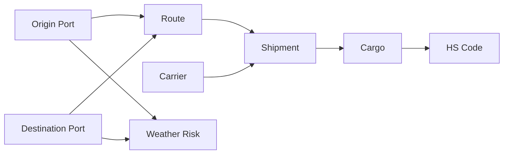

The graph helps users understand connected relationships instead of viewing each entity in isolation.

---

# 17. Digital Twin

The Digital Twin provides scenario-oriented simulation of maritime network behavior.

Possible scenarios include changes to:

- Fuel/bunker cost
- Canal delays
- Labor cost
- Foreign exchange
- Demurrage
- Carbon cost
- Freight volume
- Feeder rates
- War-risk insurance

### Simulation flow

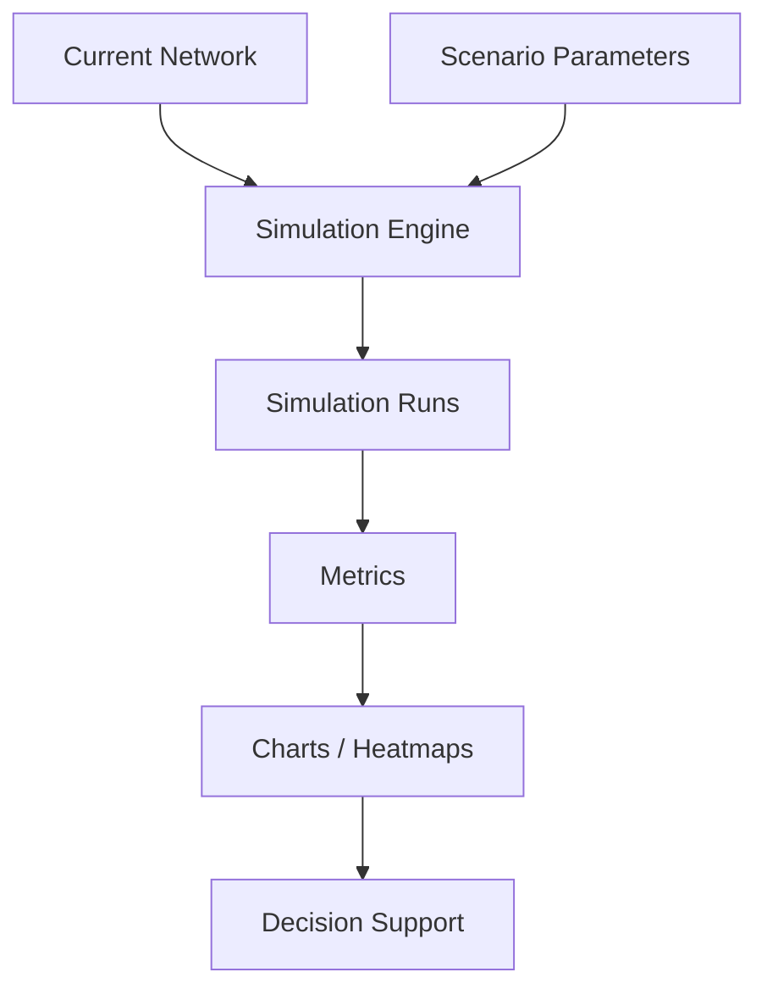

The Digital Twin is a scenario simulation capability, not a claim of complete real-time synchronization with the physical maritime world.

---

# 18. Anomaly Scanner and Data Feed Center

## Anomaly Scanner

The Anomaly Scanner highlights unusual operational patterns.

```text
Operational Data
      ↓
Feature Preparation
      ↓
Anomaly Detection
      ↓
Anomaly Flag
      ↓
Human Review
      ↓
Action
```

Isolation Forest and other appropriate analytical techniques can support anomaly detection.

## Data Feed Center

The Data Feed Center provides visibility into application data and system feeds, supporting operational review and troubleshooting.

---

# 19. Authentication and RBAC

The application includes authentication and role-based access control.

### Authentication

- bcrypt password hashing
- JWT-based session handling
- Login/session verification
- Account lock/unlock handling
- Role-aware navigation
- OTP/security-question workflow where configured

### Implemented roles

| Role | Typical access |
|---|---|
| **Admin** | Full platform access including Admin Dashboard and Data Feed Center |
| **Operations Manager** | Operational access plus Data Feed Center |
| **Freight Broker** | Operational agents and Copilot |
| **Auditor** | Read-oriented operational access and oversight |
| **Customer** | Restricted Copilot, quote, weather, notifications and translation access |

Navigation is dynamically filtered according to the authenticated role.

### Security principle

Sensitive credentials should be supplied through:

- Environment variables
- Colab Secrets
- `.env`
- Cloud secret-management systems

**Never commit passwords, API keys, JWT secrets, SMTP credentials or access tokens to GitHub.**

---

# 20. Admin Dashboard

The Admin Dashboard acts as the platform command center.

### Major areas

1. **Platform KPIs**
   - Monitored ports
   - Shipments
   - Pending alerts
   - Accelerator status

2. **GPU & VRAM Telemetry**
   - CUDA availability
   - GPU device
   - VRAM information

3. **User Management**
   - User listing
   - Role management
   - Account lock/unlock
   - Administration

4. **Database Maintenance**
   - Administrative data operations

5. **Chat Monitor**
   - Recent Copilot activity
   - Oversight/audit information

---

# 21. Database and Data

FreightQuote AI uses SQLite for structured application data.

The M4 application uses tables covering areas such as:

```text
users
chat_history
alerts
shipments
freight_quotes
ports
carriers
customers
ml_metrics
outlets
staff
inventory
marketing
feedback
audits
weather_risks
```

### Seed data

The project includes demonstration/seed data for areas such as:

- Ports
- Users
- Shipments
- Weather risks
- Alerts
- Carriers
- Customers
- Freight quotes
- Customs/tariff information
- Other operational tables

The seed data is intended for demonstration and testing and should not be treated as live maritime operational data.

---

# 22. Technology Stack

| Layer | Technology | Purpose |
|---|---|---|
| Language | Python | Core application and agent logic |
| UI | Streamlit | Web application |
| Navigation | streamlit-option-menu | Sidebar/menu navigation |
| API | FastAPI / Uvicorn | Model/API service |
| Database | SQLite | Structured operational data |
| LLM | Qwen 2.5 | Natural-language reasoning |
| Translation | NLLB-200 | Multilingual translation |
| Embeddings | Sentence Transformers | Document embeddings |
| Dense Retrieval | FAISS | Semantic vector search |
| Sparse Retrieval | BM25 | Lexical search |
| ML | scikit-learn | Prediction and benchmarking |
| Documents | PyMuPDF / pdfplumber / ReportLab / FPDF | PDF/OCR/document workflows |
| Visualization | Plotly | Analytics charts |
| Maps | Folium / streamlit-folium | Port and weather maps |
| Weather | Open-Meteo | Weather information |
| Authentication | bcrypt + PyJWT | Password/session security |
| Graph | NetworkX / graph visualization | Knowledge Graph |
| GPU | PyTorch + CUDA | Accelerated AI workloads |
| Containerization | Docker / Docker Compose | Deployment |
| Public Preview | Cloudflare Tunnel | Public routing |

---

# 23. Project Structure

The recommended repository structure is:

```text
FreightQuote_AI/
│
├── Milestone4/
│   ├── Milestone4.ipynb
│   ├── README.md
│   ├── FreightQuote_Data_Pipeline_ML_Trainer.ipynb
│   ├── FreightQuote_M4_RAG_Builder.ipynb
│   │
│   ├── screenshots/
│   │   ├── login.jpeg
│   │   ├── admin_dashboard.jpeg
│   │   ├── agent1_route.jpeg
│   │   ├── agent2_pricing.jpeg
│   │   ├── agent3_carrier.jpeg
│   │   ├── agent4_weather.jpeg
│   │   ├── agent5_margin.jpeg
│   │   ├── agent6_customs.jpeg
│   │   ├── agent7_docs.jpeg
│   │   ├── agent8_alerts.jpeg
│   │   ├── agent9_pdf_rag.jpeg
│   │   ├── ai_copilot.jpeg
│   │   ├── anomaly_scanner.jpeg
│   │   ├── data_feed_center.jpeg
│   │   ├── digital_twin.jpeg
│   │   └── knowledge_graph.jpeg
│   │
│   └── docs/
│
├── freight_app/
│   ├── app.py
│   ├── model_server.py
│   ├── admin_dash.py
│   ├── auth.py
│   ├── config.py
│   ├── db.py
│   ├── rbac.py
│   ├── seed_data.py
│   ├── ai_copilot.py
│   ├── intent_router.py
│   ├── llm_engine.py
│   ├── rag_engine.py
│   ├── translation_engine.py
│   ├── weather_context.py
│   ├── agent1_route.py
│   ├── agent2_freight.py
│   ├── agent3_freight.py
│   ├── agent4_weather_freight.py
│   ├── agent5_margin.py
│   ├── agent6_customs_freight.py
│   ├── agent7_docs.py
│   ├── agent8_translation.py
│   ├── agent9_pdf_rag.py
│   ├── notifications.py
│   ├── knowledge_graph.py
│   ├── digital_twin.py
│   ├── anomaly_scanner.py
│   ├── data_feed_center.py
│   ├── profile.py
│   └── ui_theme.py
│
├── runtime_data/
│   ├── models/
│   ├── metrics/
│   ├── faiss_indexes/
│   ├── bm25_indexes/
│   └── documents/
│
├── Dockerfile
├── docker-compose.yml
├── requirements.txt
├── .env.example
└── tests/
```

> The exact generated directory contents can vary between notebook/runtime versions. The main application boundary is the `freight_app/` module set and its runtime data.

---

# 24. Running the Project

## Google Colab

The M4 notebook is designed to recreate and launch the project.

### General flow

```text
Open Milestone4.ipynb
        ↓
Run cells from top to bottom
        ↓
Create freight_app/
        ↓
Install dependencies
        ↓
Initialize SQLite
        ↓
Seed demonstration data
        ↓
Start FastAPI model service
        ↓
Start Streamlit
        ↓
Optional Cloudflare Tunnel
```

### Streamlit

The application runs on:

```text
8501
```

Example local command:

```bash
streamlit run freight_app/app.py
```

### FastAPI model service

The model/API service runs on:

```text
8000
```

Example:

```bash
python -m uvicorn model_server:app --host 0.0.0.0 --port 8000
```

Run the FastAPI command from the application directory when using the generated notebook layout.

---

# 25. Docker Deployment

Docker separates the application into reproducible services.

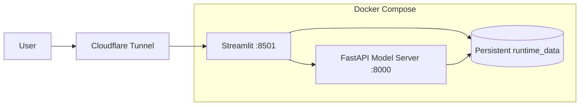

### Recommended services

- **Streamlit** — main UI on port 8501
- **FastAPI model server** — model/API service on port 8000
- **Persistent runtime data** — database, models, RAG indexes and documents

For Docker deployment, application paths should be environment-driven rather than dependent on Google Colab `/content` paths.

---

# 26. Cloudflare Public Preview

For a Colab/demo environment, the notebook can launch a temporary Cloudflare Quick Tunnel.

```text
Public Browser
      ↓
Cloudflare Tunnel
      ↓
Streamlit :8501
      ↓
FastAPI :8000
```

Example:

```bash
cloudflared tunnel --url http://localhost:8501
```

A Quick Tunnel produces a temporary `trycloudflare.com` address.

> **Important:** a Quick Tunnel URL is temporary. It should be used for development/demo purposes, not treated as a permanent production hostname.

For persistent hosting, use:

```text
Cloud VM / Server
      ↓
Docker Compose
      ↓
Managed Cloudflare Tunnel
      ↓
Persistent Domain
```

---

# 27. Screenshots

All screenshots below use the **actual repository folder and filenames**:

```text
Milestone4/screenshots/
```

> **Important:** The screenshots in the repository use `.jpeg` extensions, not `.jpg`. The relative paths below are therefore intentionally written as `screenshots/<name>.jpeg`.

## Login


Authentication entry point for the FreightQuote AI platform.

---

## Admin Dashboard


Administrative command-center interface for platform monitoring and management.

---

## Agent 1 — Route AI


Route and port intelligence interface.

---

## Agent 2 — Spot Pricing

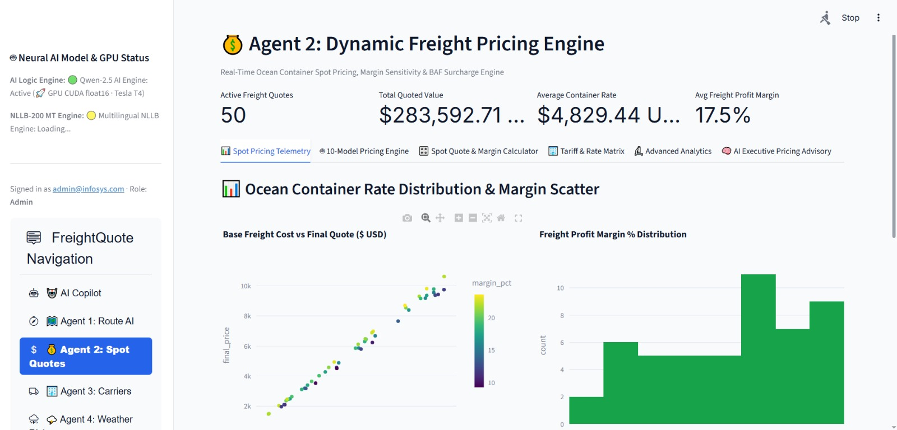

Spot freight quotation and pricing analysis.

---

## Agent 3 — Carrier Intelligence


Carrier performance and comparison interface.

---

## Agent 4 — Weather Risk


Weather and maritime-risk interface.

---

## Agent 5 — Margin Predictor


Margin and profitability analysis.

---

## Agent 6 — Customs & Tariff


Customs and tariff analysis.

---

## Agent 7 — Docs / OCR

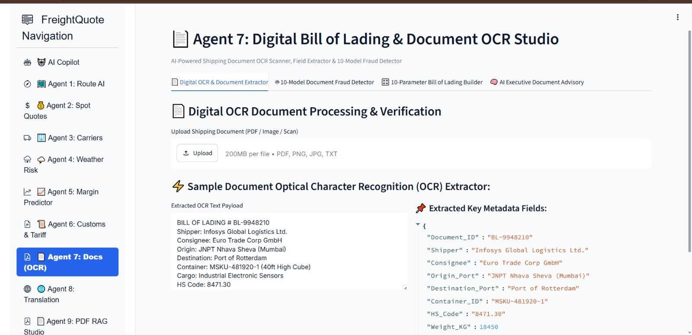

Shipping-document and OCR functionality.

---

## Notifications / Alerts

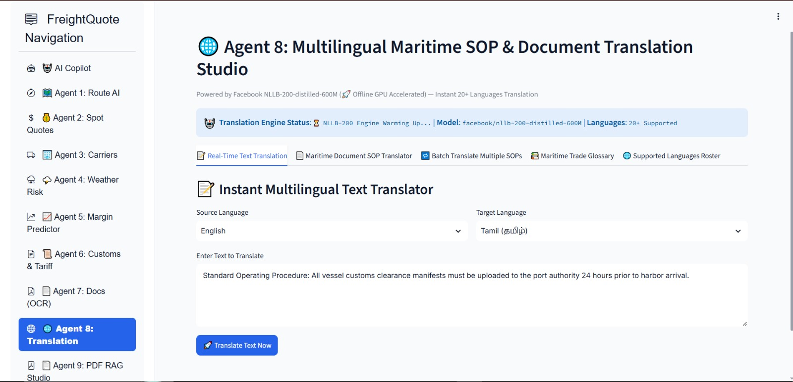

Captured Notifications/Alerts interface.

**Filename note:** `agent8_alerts.jpeg` is retained because it is the actual screenshot filename. In the final M4 architecture, **Agent 8 is Translation**, while Alerts/Incidents is consolidated into the shared **Notifications** module.

---

## Agent 9 — PDF RAG

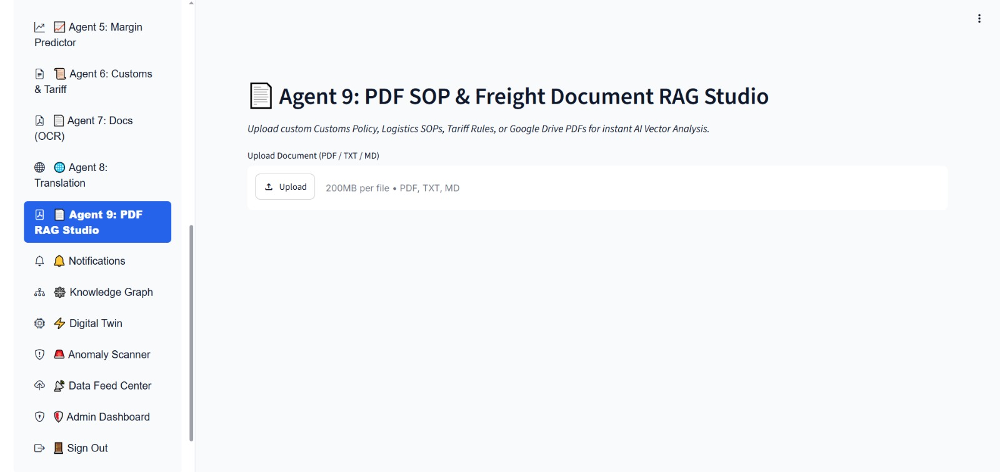

Custom document retrieval and question-answering interface.

---

## AI Copilot


Natural-language maritime decision-support interface.

---

## Anomaly Scanner


Operational anomaly-analysis interface.

---

## Data Feed Center


Data and system-feed visibility interface.

---

## Digital Twin

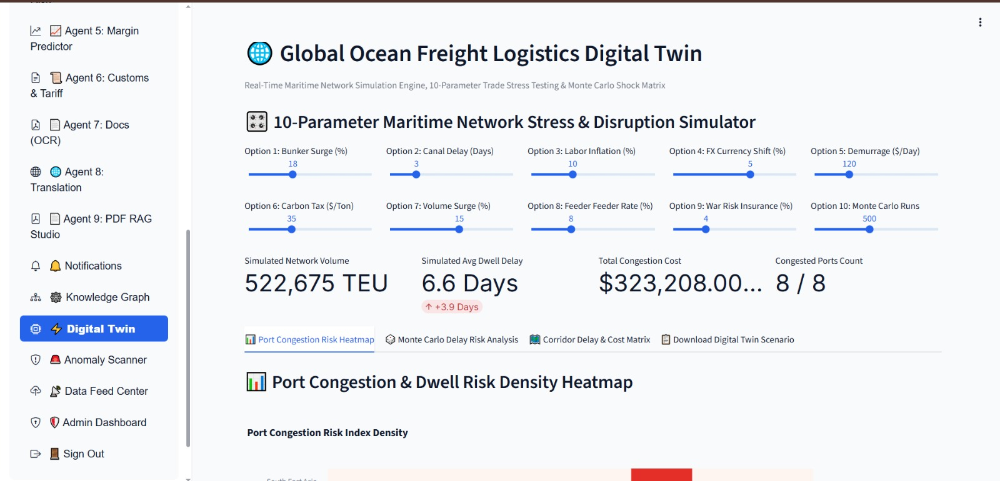

Maritime scenario simulation interface.

---

## Knowledge Graph


Maritime entity/network relationship visualization.

---

# 28. Testing and Validation

## Authentication

- [ ] Signup works
- [ ] Login works
- [ ] Invalid credentials are rejected
- [ ] JWT/session state is maintained
- [ ] Logout returns to authentication
- [ ] RBAC hides unauthorized modules
- [ ] Account lock/unlock behavior works

## Agents

- [ ] Agent 1 Route AI loads
- [ ] Agent 2 Spot Quotes loads
- [ ] Agent 3 Carriers loads
- [ ] Agent 4 Weather Risk loads
- [ ] Agent 5 Margin Predictor loads
- [ ] Agent 6 Customs & Tariff loads
- [ ] Agent 7 Docs/OCR loads
- [ ] Agent 8 Translation loads
- [ ] Agent 9 PDF RAG loads

## AI Copilot

- [ ] Query is accepted
- [ ] Appropriate module/tool is selected
- [ ] Structured values come from application evidence
- [ ] RAG questions retrieve supporting content
- [ ] Unsupported questions fail safely rather than inventing business facts

## RAG

- [ ] Document upload works
- [ ] Text extraction works
- [ ] Chunking/indexing works
- [ ] FAISS retrieval works
- [ ] BM25 retrieval works
- [ ] Evidence/citation information is displayed

## API / Model Server

- [ ] FastAPI starts on port 8000
- [ ] `/health` responds
- [ ] Qwen model loading is verified
- [ ] NLLB loading is verified when translation is used
- [ ] GPU is used when CUDA is available

## Application

- [ ] Streamlit starts on port 8501
- [ ] Database initializes
- [ ] Seed data is available
- [ ] Notifications load
- [ ] Knowledge Graph loads
- [ ] Digital Twin loads
- [ ] Anomaly Scanner loads
- [ ] Data Feed Center loads for authorized roles
- [ ] Admin Dashboard loads for authorized roles

---

# 29. Limitations

FreightQuote AI is an **academic/internship prototype** and should not be treated as a production maritime control, financial, safety or regulatory system.

### Demo/seed data

Seeded records are intended for demonstration and testing, not live operational decision-making.

### ML data

Some workflows may use fallback/synthetic data when suitable real datasets are unavailable. Such results should not be described as production accuracy.

### SQLite

SQLite is suitable for this prototype. A high-concurrency production deployment can migrate to PostgreSQL or another enterprise database.

### Live maritime telemetry

Full live AIS/vessel telemetry is future scope unless a dedicated live feed is integrated.

### Carrier APIs

Direct live carrier-rate and schedule APIs are future scope unless separately connected.

### Weather

Weather information is decision support, not a guaranteed prediction of future conditions.

### Customs

Customs/tariff information should be verified against current authoritative regulatory sources before real-world use.

### AI hallucination

Grounding reduces hallucination risk but cannot guarantee zero hallucinations.

### Digital Twin

The Digital Twin provides scenario simulation and is not a complete real-time replica of the physical maritime network.

---

# 30. Future Scope

## Advanced ML

- XGBoost
- LightGBM
- Ensemble learning
- Model drift monitoring
- Continuous retraining
- Stronger evaluation datasets

## Real-Time Maritime Data

- AIS
- Vessel tracking
- Live port congestion
- Carrier APIs
- Freight-rate APIs
- ETA feeds

## Production Data Infrastructure

- PostgreSQL
- Redis
- Cloud object storage
- Enterprise vector databases

## Advanced RAG

- Neural reranking
- Better citation verification
- Document versioning
- Retrieval evaluation
- Knowledge-base monitoring

## Advanced Agentic AI

- Multi-step tool execution
- Planning agents
- Agent evaluation
- Human feedback loops
- Better uncertainty handling

## Digital Twin

- Real-time synchronization
- Monte Carlo simulation
- Predictive disruption modelling
- Corridor optimization

## Enterprise Deployment

- Kubernetes
- CI/CD
- Centralized logging
- Observability
- Enterprise secrets management
- Fine-grained authorization

---

# 31. Conclusion

FreightQuote AI demonstrates how **Agentic AI, machine learning, retrieval-augmented generation, structured operational data, external APIs and visualization can be combined into one maritime decision-support platform**.

The final M4 architecture contains nine specialized agents:

```text
1. Route Intelligence & Eco-Speed AI
2. Spot Freight Quote & Cost Engine
3. Ocean Carrier Intelligence & Audit
4. Weather Risk & Typhoon Predictor
5. Freight Margin Predictor & Yield Engine
6. Customs & Tariff Compliance Engine
7. Bill of Lading & Document OCR Studio
8. Multilingual Maritime Translator
9. PDF Vector RAG Studio
```

Shared platform capabilities provide:

```text
AI Copilot
Notifications
Knowledge Graph
Digital Twin
Anomaly Scanner
Data Feed Center
Admin Dashboard
Authentication
RBAC
```

The overall architecture is:

```text
                 Maritime User
                      ↓
              Streamlit Interface
                      ↓
                AI Copilot / Agents
                      ↓
              Intent & Orchestration
                      ↓
       ┌──────────────┼──────────────┐
       ↓              ↓              ↓
    SQLite            ML          RAG / API
       │              │              │
       └──────────────┼──────────────┘
                      ↓
                Grounded Context
                      ↓
                  Qwen 2.5
                      ↓
             Human-readable Output
```

FreightQuote AI therefore demonstrates an end-to-end architecture in which specialized maritime tools provide evidence and predictions, retrieval provides document knowledge, and the language model turns those results into understandable decision support.

---

## ⚠️ Disclaimer

This project was developed as an academic/internship project for learning, experimentation and demonstration. It should not replace authoritative maritime, customs, financial, contractual, safety or regulatory systems. Real-world operational decisions should always be validated against current authoritative sources.

---

## 🎓 Project Information

**Project:** FreightQuote AI  
**Program:** Infosys Springboard 7.0  
**Batch:** 1  
**Milestone:** 4  
**Domain:** Agentic AI for Maritime Freight Pricing and Route Optimization  
**Frontend:** Streamlit  
**Backend:** FastAPI  
**Database:** SQLite  
**LLM:** Qwen 2.5  
**RAG:** FAISS + BM25  
**Translation:** NLLB-200  
**Weather:** Open-Meteo  
**ML:** scikit-learn  
**Deployment:** Docker / Docker Compose / Cloudflare Tunnel
