# 🚢 FreightQuote AI

## Agentic AI for Maritime Freight Pricing & Route Optimization

**Infosys Springboard 7.0 — Batch 1 | Milestone 4**

FreightQuote AI is an agentic AI decision-support platform for maritime/ocean-freight operations. It combines nine specialized reasoning agents, machine-learning models, structured operational data, hybrid document RAG, live weather information, multilingual translation, document intelligence, operational dashboards, a Knowledge Graph, Digital Twin simulation, anomaly detection, authentication/RBAC, and an AI Copilot in a unified Streamlit application.

> **Core principle:** use AI to reason over verified tools, data, models, APIs, and documents instead of allowing the language model to independently invent operational values.

## Table of Contents

- [Project Overview](#project-overview)
- [Problem Statement](#problem-statement)
- [Proposed Solution](#proposed-solution)
- [Objectives](#objectives)
- [Key Features](#key-features)
- [System Architecture](#system-architecture)
- [Five-Layer Architecture](#five-layer-architecture)
- [Multi-Agent Architecture](#multi-agent-architecture)
- [Agent Catalog](#agent-catalog)
- [AI Copilot](#ai-copilot)
- [Hybrid RAG](#hybrid-rag)
- [RAG Builder](#rag-builder)
- [Machine Learning Pipeline](#machine-learning-pipeline)
- [Route Optimization](#route-optimization)
- [Pricing](#pricing)
- [Weather Risk](#weather-risk)
- [Carrier Intelligence](#carrier-intelligence)
- [Margin Prediction](#margin-prediction)
- [Customs and Tariff](#customs-and-tariff)
- [Documents and OCR](#documents-and-ocr)
- [Translation](#translation)
- [Digital Twin](#digital-twin)
- [Knowledge Graph](#knowledge-graph)
- [Anomaly Detection](#anomaly-detection)
- [Data Feed Center](#data-feed-center)
- [Authentication and RBAC](#authentication-and-rbac)
- [Admin Dashboard](#admin-dashboard)
- [Database Architecture](#database-architecture)
- [End-to-End Flow](#end-to-end-flow)
- [Technology Stack](#technology-stack)
- [Project Components](#project-components)
- [Deployment](#deployment)
- [Docker Architecture](#docker-architecture)
- [Cloudflare Tunnel](#cloudflare-tunnel)
- [Security](#security)
- [Reliability and Grounding](#reliability-and-grounding)
- [Testing](#testing)
- [Demo Flow](#demo-flow)
- [Limitations](#limitations)
- [Future Scope](#future-scope)
- [Diagram Generation Plan](#diagram-generation-plan)
- [Conclusion](#conclusion)

## Project Overview

Maritime freight operations require decisions using information spread across freight rates, ports, routes, congestion, carriers, weather, customs regulations, documents, historical data, and operational procedures. FreightQuote AI brings these capabilities into one agentic decision-support platform.

The application contains nine specialized agents plus shared services for authentication, orchestration, RAG, translation, notifications, administration, system health, Knowledge Graph, Digital Twin, anomaly detection, and data feeds.

## Problem Statement

Ocean-freight decisions are affected by volatile prices, port congestion, route delays, weather risk, carrier reliability, customs complexity, document-processing overhead, language barriers, and fragmented reference information. A general-purpose chatbot cannot reliably perform structured calculations, database lookups, ML predictions, live API calls, and document retrieval on its own.

FreightQuote AI therefore combines specialized agents with tools and evidence sources.

## Proposed Solution

```text
User Request
     ↓
Intent / Agent Selection
     ↓
Specialized Agent(s)
     ↓
Database / ML / APIs / RAG / Solvers
     ↓
Evidence & Results
     ↓
Grounding / Validation
     ↓
Qwen 2.5
     ↓
Grounded Final Response
```

Example query:

> What will it cost to ship a 20ft container from Chennai to Rotterdam next week and are there weather risks?

The system can combine route intelligence, pricing, weather, structured data, and RAG evidence before generating a consolidated response.

## Objectives

- Build an AI-assisted maritime freight platform.
- Automate repetitive freight-analysis tasks.
- Provide nine specialized reasoning agents.
- Combine structured and unstructured knowledge.
- Use ML for prediction and optimization.
- Ground LLM responses in verified context.
- Provide evidence and explainability.
- Integrate live weather information.
- Support multilingual freight information.
- Provide document intelligence.
- Provide maritime Digital Twin simulation.
- Provide connected maritime entities through a Knowledge Graph.
- Provide authentication and role-based access.
- Prepare the system for containerized deployment.

## Key Features

| Capability | Purpose |
|---|---|
| AI Copilot | Natural-language maritime assistant |
| Agent 1 — Route AI | Route and port intelligence |
| Agent 2 — Dynamic Pricing | Freight quote prediction |
| Agent 3 — Carrier Intelligence | Carrier performance and suitability |
| Agent 4 — Weather Risk | Weather and disruption risk |
| Agent 5 — Margin Predictor | Profitability and margin analysis |
| Agent 6 — Customs & Tariff | Customs and tariff intelligence |
| Agent 7 — Docs/OCR | Shipping-document processing |
| Agent 8 — Translation | Multilingual maritime content |
| Agent 9 — PDF RAG | Document-grounded retrieval |
| Hybrid RAG | FAISS + BM25 retrieval |
| Knowledge Graph | Maritime entity relationships |
| Digital Twin | Scenario/network simulation |
| Anomaly Scanner | Operational anomaly detection |
| Data Feed Center | Data-source/system visibility |
| Admin Dashboard | Users, models, audit and health |
| Notifications | Operational alerts |
| Authentication/RBAC | Secure role-aware access |

## System Architecture

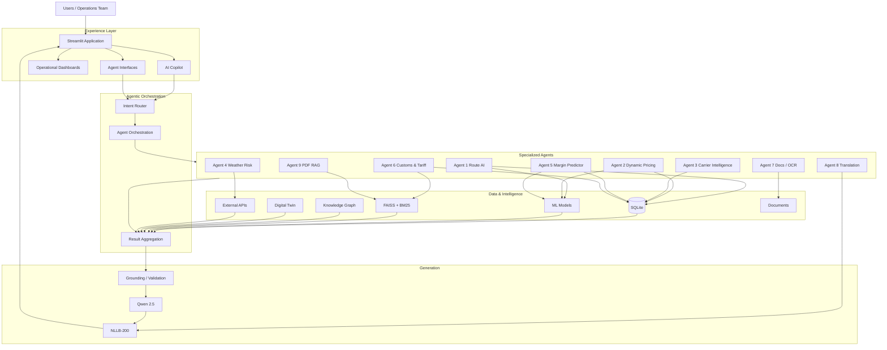

**Image to generate later:** `docs/diagrams/01-system-architecture.png`

## Five-Layer Architecture

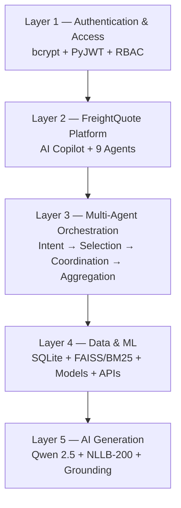

**Image:** `02-five-layer-architecture.png`

## Multi-Agent Architecture

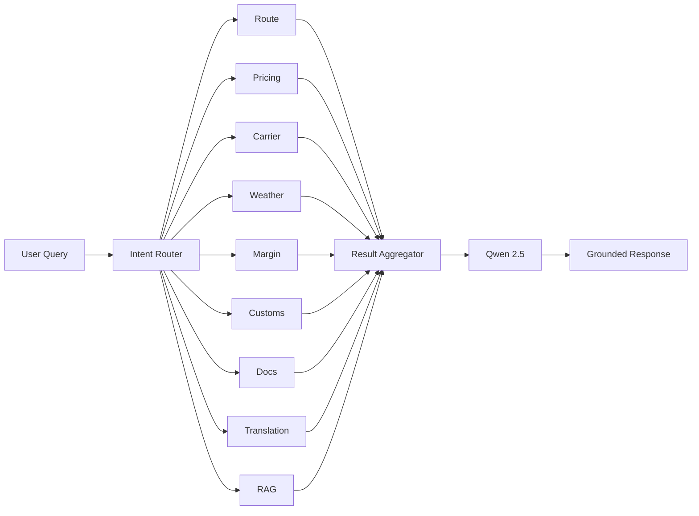

**Image:** `03-multi-agent-architecture.png`

## Agent Catalog

### Agent 1 — Route & Port Intelligence

Performs port selection, route comparison, distance calculation, congestion-aware scoring, risk-aware ranking, and map visualization. Haversine great-circle distance is used for geographic distance between coordinates. Candidate routes can be scored using distance and operational factors rather than distance alone.

### Agent 2 — Dynamic Freight Pricing

Supports freight quotation, cost prediction, quote comparison, and pricing explainability.

```text
Base Freight + Fuel/BAF + Fees/Surcharges + Other Factors → Final Quote
```

The ML training pipeline can benchmark multiple regression algorithms and select a strong candidate using validation metrics.

### Agent 3 — Carrier Intelligence

Evaluates carrier reliability, punctuality, cost efficiency, operational risk, and compliance-related indicators and presents supporting factors through carrier scorecards.

### Agent 4 — Weather & Risk

Uses available weather information to identify temperature, wind, weather-condition, and port-related risk signals. Open-Meteo is used for live weather where configured.

### Agent 5 — Margin Predictor

Analyzes expected cost, customer price, revenue, margin, and risk-adjusted profitability.

### Agent 6 — Customs & Tariff

Supports HS-code, commodity, origin/destination, duty/tariff, clearance-risk, and document-related analysis using structured data and relevant knowledge sources.

### Agent 7 — Documents / OCR

Processes freight documents such as Bills of Lading through document upload, OCR/text extraction, field extraction, validation, and structured metadata.

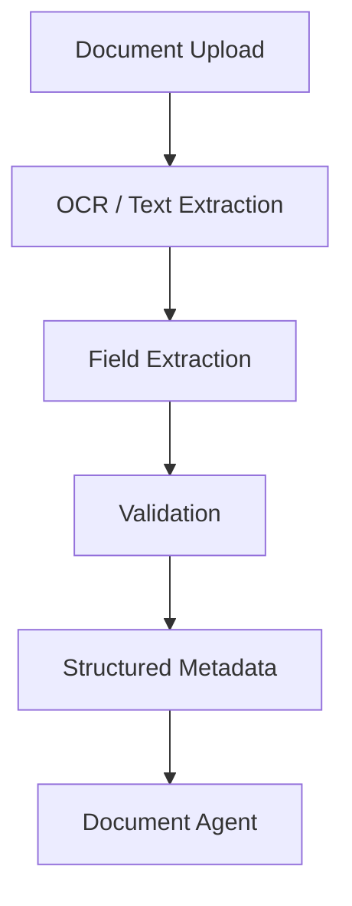

**Image:** `14-document-ocr-flow.png`

### Agent 8 — Translation

Uses NLLB-200 for multilingual maritime content. Domain-sensitive values such as port codes, HS codes, TEU, BAF, numbers, currencies, and units should be preserved and validated.

### Agent 9 — PDF RAG

Retrieves evidence from maritime reference documents such as SOPs, customs material, tariff references, freight guides, port documents, and carrier material.

## AI Copilot

The Copilot is the natural-language interface over the FreightQuote intelligence layer.

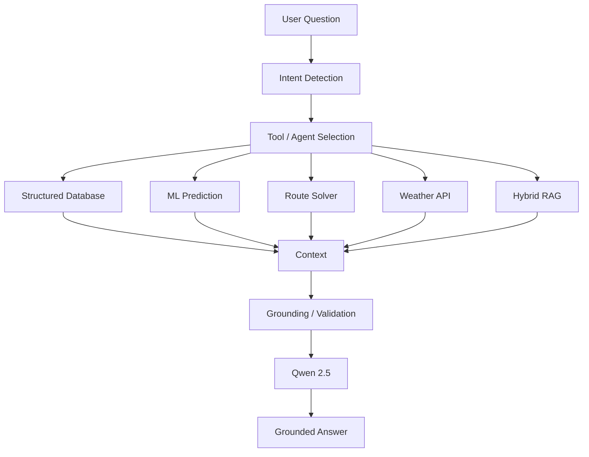

**Image:** `04-ai-copilot-flow.png`

The architecture is designed to reduce hallucination risk. It does not mathematically guarantee zero hallucinations. When evidence is inadequate, a controlled insufficient-information response is preferred over invented operational values.

## Hybrid RAG

FAISS provides dense semantic retrieval, while BM25 provides lexical/exact-term retrieval. This is useful for maritime terms such as TEU, BAF, HS Code, Bill of Lading, port names, and carrier names.

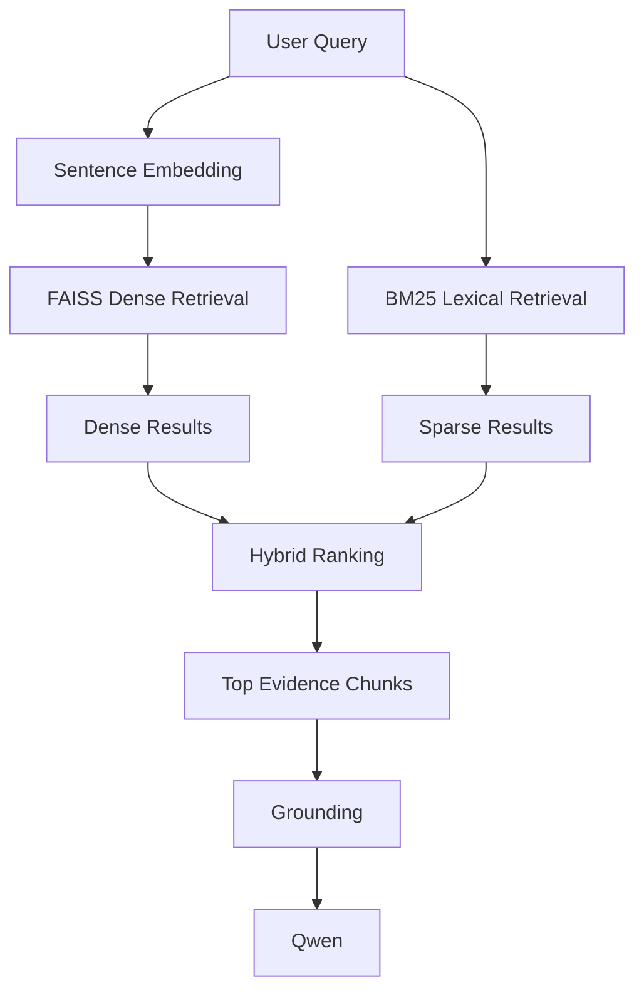

**Image:** `05-hybrid-rag.png`

Conceptually:

```text
Hybrid Score = weighted dense similarity + weighted BM25 relevance
```

The exact weighting is an implementation/configuration detail and should not be presented as a universal constant.

## RAG Builder

The separate RAG Builder prepares reusable retrieval artifacts.

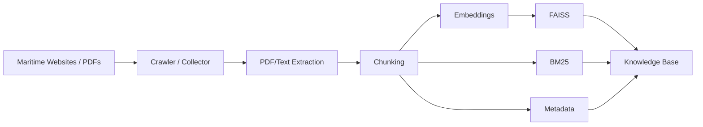

**Image:** `06-rag-builder-pipeline.png`

The builder has been used to create a large maritime/trade corpus and thousands of indexed chunks/vectors. The final runtime should explicitly point to the intended index location rather than assuming every builder artifact is automatically consumed.

## Machine Learning Pipeline

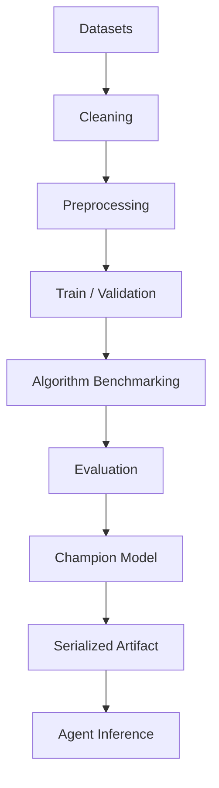

**Image:** `07-ml-training-pipeline.png`

Candidate algorithms include Random Forest, Gradient Boosting, Linear/Ridge/Lasso Regression, Decision Tree, SVR/SVC, and other task-appropriate scikit-learn models.

**Important:** some tasks can fall back to synthetic data when a real dataset or target is unavailable. Synthetic-data metrics must not be presented as production accuracy.

## Route Optimization

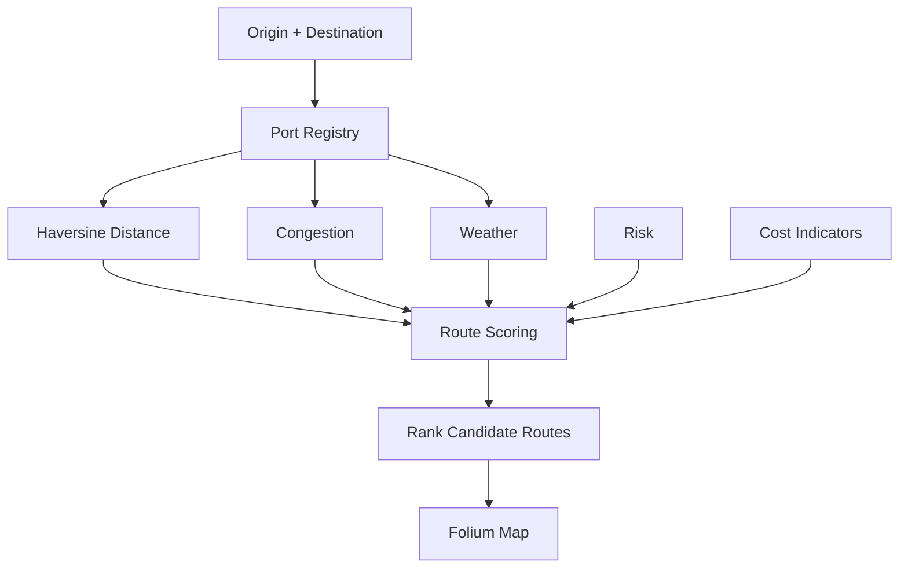

**Image:** `08-route-optimization.png`

## Dynamic Freight Pricing

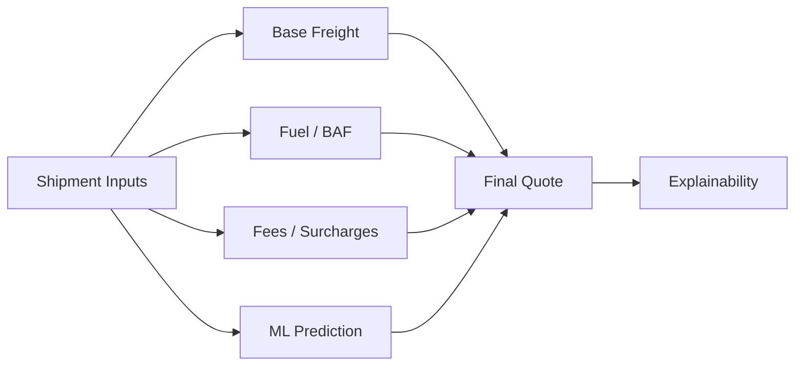

**Image:** `09-pricing-pipeline.png`

## Weather Risk

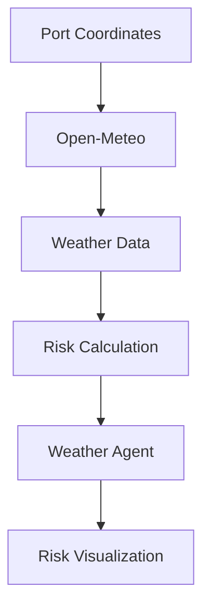

**Image:** `10-weather-risk-flow.png`

## Carrier Intelligence

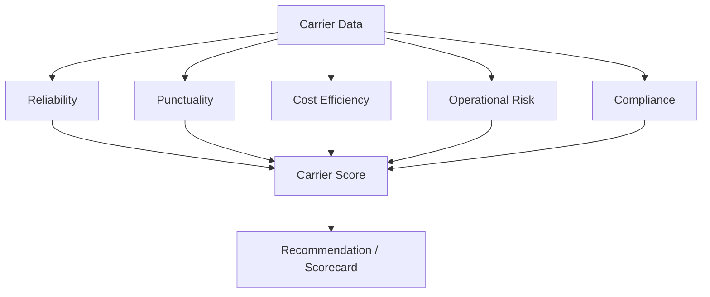

**Image:** `11-carrier-intelligence.png`

## Margin Prediction

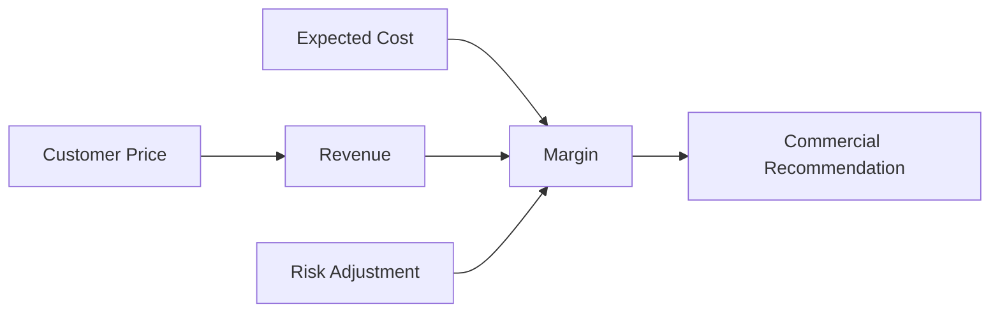

**Image:** `12-margin-prediction.png`

## Customs and Tariff

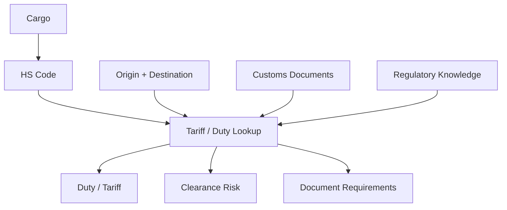

**Image:** `13-customs-tariff-flow.png`

## Documents and OCR

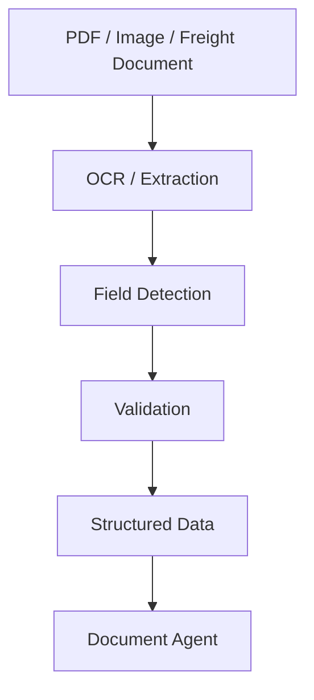

## Translation

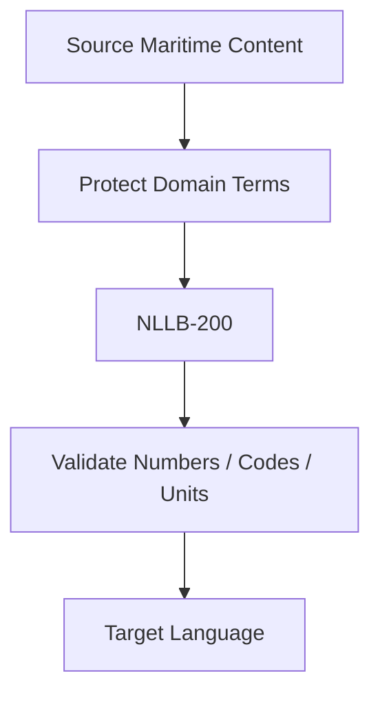

**Image:** `15-translation-flow.png`

## Digital Twin

The Digital Twin provides scenario analysis for maritime operations. Example variables include fuel-price changes, canal/port delay, labor inflation, FX shifts, demurrage, carbon cost, freight-volume changes, feeder rates, and war-risk insurance.

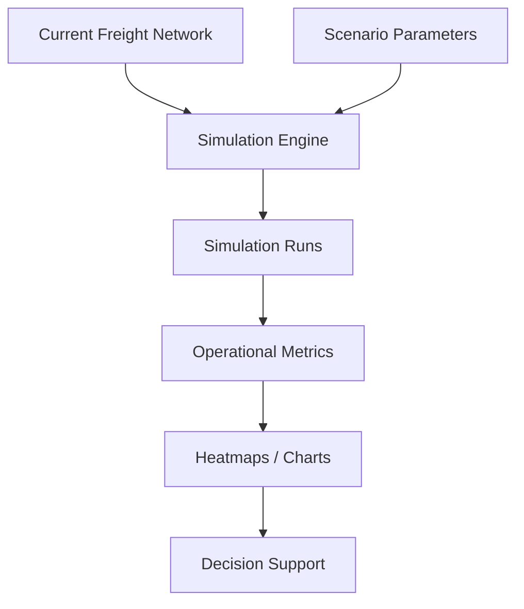

**Image:** `16-digital-twin.png`

The Digital Twin is a decision-support simulation and not a claim of real-time synchronization with the physical maritime network.

## Knowledge Graph

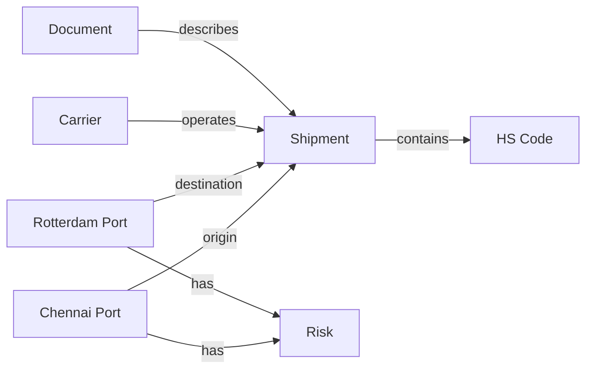

**Image:** `17-knowledge-graph.png`

## Anomaly Detection

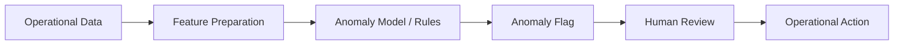

**Image:** `18-anomaly-detection.png`

## Data Feed Center

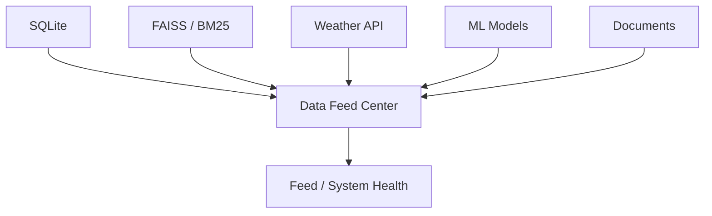

**Image:** `19-data-feed-center.png`

## Authentication and RBAC

```mermaid
flowchart LR
    S[Signup] --> H[bcrypt Password Hash]
    L[Login] --> H
    H --> J[PyJWT Session]
    J --> R[Role-Based Access]
    R --> APP[FreightQuote AI]
```

**Image:** `20-authentication-rbac.png`

Typical role categories can include Admin, Freight Broker, Dispatcher/Operations, Customer, and Auditor depending on the configured M4 RBAC policy.

## Admin Dashboard

```mermaid
flowchart TD
    ADMIN[Admin]
    ADMIN --> U[User Management]
    ADMIN --> ML[ML Performance Ledger]
    ADMIN --> AU[Chat / Audit Trail]
    ADMIN --> H[System Health]
```

**Image:** `21-admin-dashboard.png`

## Database Architecture

```mermaid
erDiagram
    USERS ||--o{ CHAT_HISTORY : creates
    USERS ||--o{ QUOTES : creates
    SHIPMENTS ||--o{ QUOTES : receives
    SHIPMENTS }o--|| CARRIERS : uses
    SHIPMENTS }o--|| PORTS : origin
    SHIPMENTS }o--|| PORTS : destination
    QUOTES ||--o{ NOTIFICATIONS : generates
    PORTS ||--o{ WEATHER_RISK : has
    DOCUMENTS ||--o{ CHAT_HISTORY : supports
```

**Image:** `22-database-erd.png`

The diagram is conceptual; the exact populated schema should follow the current M4 database initialization code.

## End-to-End Flow

```mermaid
sequenceDiagram
    participant U as User
    participant UI as Streamlit
    participant R as Intent Router
    participant A as Agent(s)
    participant D as Data / ML / APIs / RAG
    participant G as Grounding
    participant Q as Qwen
    U->>UI: Submit question
    UI->>R: Analyze intent
    R->>A: Select agent(s)
    A->>D: Request evidence / prediction
    D-->>A: Return results
    A-->>G: Structured evidence
    G->>Q: Grounded context
    Q-->>G: Generated response
    G-->>UI: Validated answer + evidence
```

**Image:** `23-end-to-end-sequence.png`

## Technology Stack

| Technology | Role |
|---|---|
| Python | Main language |
| Streamlit | UI/application |
| FastAPI + Uvicorn | Model/API service |
| SQLite | Structured data |
| Qwen2.5 3B / 1.5B | LLM generation/fallback |
| Sentence Transformers | Embeddings |
| FAISS | Dense retrieval |
| BM25 | Sparse retrieval |
| scikit-learn | ML |
| NLLB-200 | Translation |
| Open-Meteo | Weather |
| Folium | Maps |
| Plotly | Charts |
| PyMuPDF | PDF processing |
| ReportLab / FPDF | Document generation |
| bcrypt | Password hashing |
| PyJWT | Sessions/tokens |
| joblib | ML artifact persistence |
| NetworkX / graph tools | Knowledge Graph |
| Google Colab | Development/demo runtime |
| Docker / Compose | Containerization |
| Cloudflare Tunnel | Public access |

## Project Components

The current M4 notebook generates/uses components including:

```text
freight_app/
├── app.py
├── model_server.py
├── admin_dash.py
├── profile.py
├── ai_copilot.py
├── agent1_route.py
├── agent2_freight.py
├── agent3_freight.py
├── agent4_weather_freight.py
├── agent5_margin.py
├── agent6_customs_freight.py
├── agent7_docs.py
├── agent8_translation.py
├── agent9_pdf_rag.py
├── anomaly_scanner.py
├── auth.py
├── config.py
├── data_feed_center.py
├── db.py
├── digital_twin.py
├── intent_router.py
├── knowledge_graph.py
├── llm_engine.py
├── notifications.py
├── rag_engine.py
├── rbac.py
├── seed_data.py
├── translation_engine.py
├── ui_theme.py
└── weather_context.py
```

Runtime artifacts may include model files, database files, RAG indexes, uploaded documents, and generated reports. The exact location depends on whether the application is running in Colab or Docker.

## Runtime / Data Flow

```mermaid
flowchart TB
    USER[User] --> UI[Streamlit]
    UI --> AUTH[Authentication / RBAC]
    AUTH --> ROUTER[Intent Router]
    ROUTER --> AGENTS[Specialized Agents]
    AGENTS --> DB[(SQLite)]
    AGENTS --> ML[ML Models]
    AGENTS --> RAG[FAISS + BM25]
    AGENTS --> WX[Open-Meteo]
    AGENTS --> DOC[Documents]
    AGENTS --> KG[Knowledge Graph]
    AGENTS --> DT[Digital Twin]
    DB --> LLM[Qwen 2.5]
    ML --> LLM
    RAG --> LLM
    WX --> LLM
    DOC --> LLM
    KG --> LLM
    DT --> LLM
    LLM --> TR[NLLB-200 where required]
    TR --> UI
```

**Image:** `24-runtime-data-flow.png`

## Deployment

Docker packages and runs the application; it is not itself the permanent host. A production-like deployment should use a cloud VM/server or equivalent compute environment.

```mermaid
flowchart TB
    USER[Internet User] --> CF[Cloudflare Tunnel]
    CF --> ST[Streamlit :8501]
    ST --> MS[Model Server :8000]
    ST --> DATA[(Persistent Runtime Data)]
    MS --> DATA
```

**Image:** `25-docker-deployment.png`

Recommended logical services:

- `streamlit` — UI on port 8501
- `model_server` — model/API service on port 8000
- persistent runtime storage for database, models, RAG indexes, documents, and generated files
- optional `cloudflared` service for public access

## Cloudflare Tunnel

```mermaid
flowchart LR
    U[Public User] --> C[Cloudflare] --> T[Cloudflare Tunnel] --> APP[Streamlit :8501]
```

**Image:** `26-cloudflare-tunnel.png`

For testing, a temporary quick tunnel may be used. For a stable deployment, use a named/managed tunnel and a real domain.

## Security

- bcrypt password hashing
- PyJWT session handling
- RBAC
- Protected application areas
- Environment variables / Colab Secrets / Streamlit Secrets for credentials
- No committed API keys or production secrets
- Persistent data kept outside public static assets
- Least-privilege deployment where possible
- Container/image vulnerability scanning for production deployment

## Reliability and Grounding

### Ground before generating
Retrieve relevant information before asking the LLM to formulate the answer.

### Use the correct tool

```text
Structured data → Database / SQL
Prediction → ML model
Route → Route solver
Weather → Weather API
Document question → RAG
Translation → NLLB
```

### Show evidence
Where applicable, expose source document, page/chunk, retrieval score, and supporting snippet.

### Refuse unsupported answers
Prefer insufficient information over confident fabrication.

### Distinguish live and demo data
Clearly label live API information versus fallback/demo values.

### Explain predictions
Expose important factors behind pricing and prediction results wherever possible.

## Testing

### Authentication
- Signup
- Login
- Password validation
- Session handling
- Role restrictions

### Agents
- Route
- Pricing
- Carrier
- Weather
- Margin
- Customs
- Documents
- Translation
- RAG

### Copilot
- Intent routing
- Agent/tool selection
- Grounding
- Evidence display
- Unsupported-query fallback

### RAG
- FAISS loading
- BM25 loading
- Hybrid ranking
- Source metadata
- Document retrieval

### ML
- Model loading
- Preprocessing
- Prediction
- Error handling

### APIs
- Weather availability
- Timeout/failure handling

### UI
- Navigation
- Forms
- Dashboards
- Agent pages
- Tables/charts
- Loading/error states

## Recommended Demo Flow

```text
Login
  ↓
Dashboard
  ↓
Agent 1 — Route Intelligence
  ↓
Agent 2 — Freight Pricing
  ↓
Agent 4 — Weather Risk
  ↓
AI Copilot
  ↓
Agent 9 — PDF RAG
  ↓
Evidence / Grounding
  ↓
Customs / Translation
  ↓
Digital Twin
  ↓
Knowledge Graph
  ↓
Admin Dashboard
```

A strong Copilot demonstration combines pricing + route + weather in a single natural-language request.

## Limitations

FreightQuote AI is an academic/internship prototype. Quotes, predictions, weather risk, customs interpretation, translations, route recommendations, Digital Twin scenarios, and carrier recommendations should not be treated as production maritime, customs, financial, contractual, or safety decisions without authoritative validation.

Some ML tasks can use synthetic fallback data. SQLite is appropriate for the prototype but PostgreSQL or another production database is preferable for high-concurrency deployment. Live AIS/vessel telemetry and live carrier-rate APIs are future integrations unless separately configured. Grounding reduces hallucination risk but cannot guarantee zero hallucinations.

## Future Scope

- XGBoost / LightGBM and advanced ensembles
- Real shipping-line and freight-rate APIs
- AIS and vessel-position feeds
- Production port-congestion feeds
- PostgreSQL migration
- Cloud vector database
- Neural rerankers
- Stronger citation verification
- Continuous ML monitoring and drift detection
- Richer Digital Twin simulation
- Automated document ingestion
- Enterprise observability
- Kubernetes deployment
- Advanced human-feedback loops

## Diagram Generation Plan

The repository should eventually contain:

```text
docs/
└── diagrams/
    ├── 01-system-architecture.png
    ├── 02-five-layer-architecture.png
    ├── 03-multi-agent-architecture.png
    ├── 04-ai-copilot-flow.png
    ├── 05-hybrid-rag.png
    ├── 06-rag-builder-pipeline.png
    ├── 07-ml-training-pipeline.png
    ├── 08-route-optimization.png
    ├── 09-pricing-pipeline.png
    ├── 10-weather-risk-flow.png
    ├── 11-carrier-intelligence.png
    ├── 12-margin-prediction.png
    ├── 13-customs-tariff-flow.png
    ├── 14-document-ocr-flow.png
    ├── 15-translation-flow.png
    ├── 16-digital-twin.png
    ├── 17-knowledge-graph.png
    ├── 18-anomaly-detection.png
    ├── 19-data-feed-center.png
    ├── 20-authentication-rbac.png
    ├── 21-admin-dashboard.png
    ├── 22-database-erd.png
    ├── 23-end-to-end-sequence.png
    ├── 24-runtime-data-flow.png
    ├── 25-docker-deployment.png
    └── 26-cloudflare-tunnel.png
```

The Mermaid blocks in this README are the source specifications for those images. The images can be generated later without changing the documented architecture.

## Architecture at a Glance

```text
                         FREIGHTQUOTE AI
                               │
                               ▼
                       ┌───────────────┐
                       │  Streamlit UI │
                       └───────┬───────┘
                               │
              ┌────────────────┼────────────────┐
              │                │                │
              ▼                ▼                ▼
        AI Copilot       Agent Pages      Dashboards
              │                │                │
              └────────────────┼────────────────┘
                               ▼
                       ┌───────────────┐
                       │ Intent Router │
                       └───────┬───────┘
                               │
              ┌────────────────┼────────────────┐
              ▼                ▼                ▼
         Route/Pricing     Risk/Customs     Docs/RAG
              │                │                │
              └────────────────┼────────────────┘
                               ▼
                 ┌─────────────────────────┐
                 │ Data + Intelligence    │
                 │ SQLite / ML / RAG / API│
                 └────────────┬────────────┘
                              ▼
                       ┌───────────────┐
                       │ Grounding     │
                       │ + Validation  │
                       └───────┬───────┘
                               ▼
                       ┌───────────────┐
                       │ Qwen 2.5 LLM  │
                       └───────┬───────┘
                               ▼
                     Grounded Final Answer
```

## Why FreightQuote AI?

```text
Structured Data
      +
Machine Learning
      +
Route Optimization
      +
Live Weather
      +
Document Intelligence
      +
Hybrid RAG
      +
Knowledge Graph
      +
Digital Twin
      +
Multilingual AI
      +
LLM Reasoning
      ↓
Maritime Decision Intelligence
```

The key architectural idea is that the LLM is not the entire intelligence layer. Specialized agents perform domain-specific work, tools provide evidence, ML provides predictions, RAG provides document knowledge, APIs provide live context, and the LLM turns those grounded results into an understandable response.

## Conclusion

FreightQuote AI demonstrates an end-to-end Agentic AI platform for maritime freight pricing and route optimization. It combines nine specialized agents, AI Copilot, machine learning, hybrid RAG, document intelligence, weather intelligence, route optimization, carrier evaluation, customs analysis, margin prediction, translation, Knowledge Graph, Digital Twin, anomaly detection, data-feed monitoring, authentication/RBAC, administrative monitoring, and containerization.

The central design principle is **grounded, explainable, modular AI decision support** rather than treating a language model as an unrestricted source of operational truth.

## Project Information

**Project:** FreightQuote AI  
**Domain:** Agentic AI for Maritime Freight Pricing & Route Optimization  
**Program:** Infosys Springboard 7.0  
**Batch:** 1  
**Milestone:** 4  
**Primary UI:** Streamlit  
**Language:** Python  
**LLM:** Qwen 2.5  
**RAG:** FAISS + BM25  
**Translation:** NLLB-200  
**Database:** SQLite  
**Weather:** Open-Meteo  
**ML:** scikit-learn  
**Deployment:** Docker / Docker Compose / Cloudflare Tunnel

## Disclaimer

This project is an academic/internship prototype intended for demonstration and experimentation. It is not a substitute for authoritative maritime, customs, financial, contractual, or safety systems. Always validate operational decisions against current authoritative sources before real-world use.
